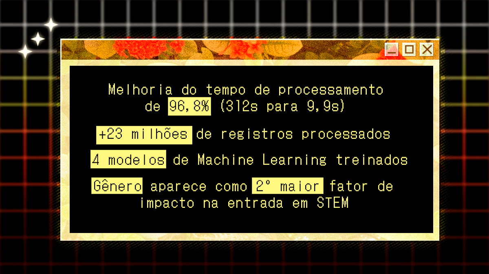
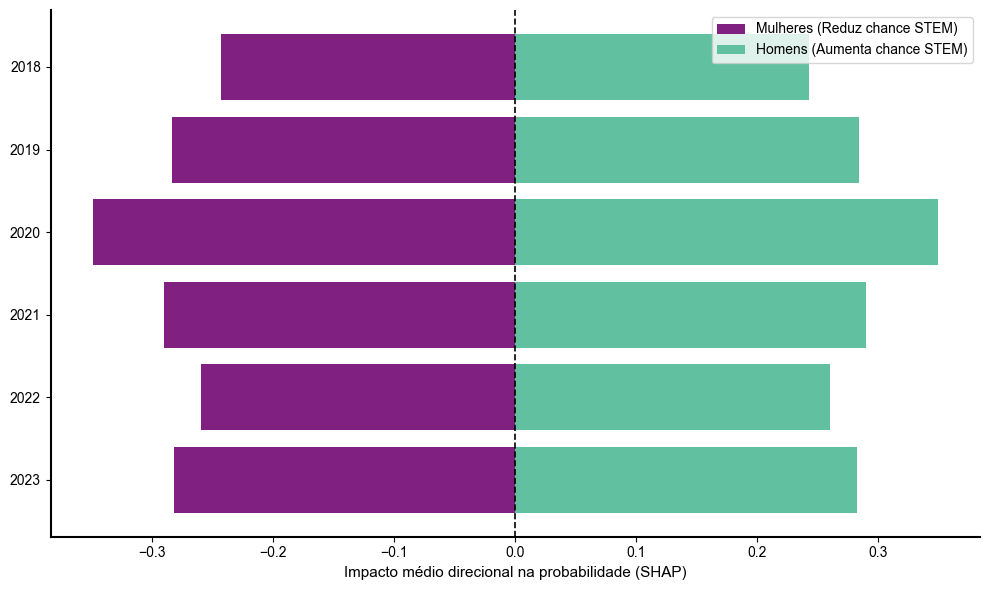
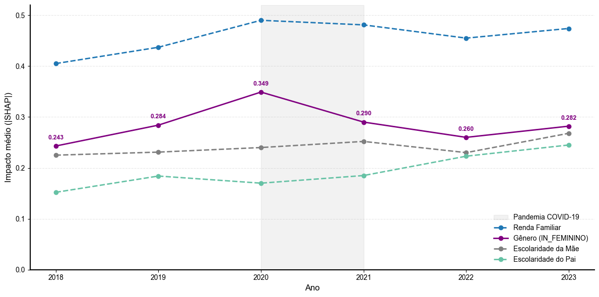
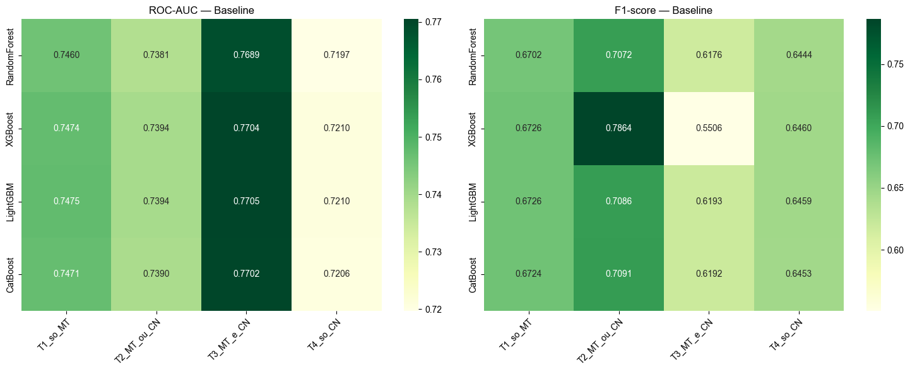
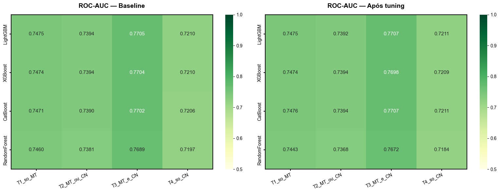

# O impacto do gênero na inclusão STEM: análise de Machine Learning em +23M registros microdados do Enem (2018-2023)


## Resumo do projeto 

> Projeto de Análise e Ciência de Dados de ponta a ponta | 23M+ registros | +11GB de dados brutos | Melhoria de 96,8% no tempo de processamento | 4 modelos de ML | SHAP | Optuna

- O projeto envolveu utilizar dados públicos para avaliar o quanto gênero impacta na possibilidade de meninas e mulheres adentrarem a área de exatas.
- A análise extensiva de dados públicos do Enem, consistindo em mais de 11GB de dados descompactados, envolveu a construção de um pipeline de ponta a ponta de tratamento de dados em larga escala, utilizando +23M de registros para testar 4 modelos preditivos. Através do processamento e limpeza dos dados em Parquet, o projeto tornou-se viável.
- Construí uma pipeline eficiente em termos de computação para comparar 4 modelos *ensemble* com otimização de hiperparâmetros pela biblioteca Optuna e interpretação do modelo com SHAP.
- Traduzi os resultados em insights acionáveis via SHAP, revelando que gênero é o **2º fator mais relevante na definição de um perfil para STEM — atrás só da renda familiar —** um achado com aplicação direta para políticas de incentivo e programas de diversidade.




## O que esse projeto responde

A presença feminina em cursos de Ciências, Tecnologia, Engenharia e Matemática (STEM) segue desproporcional à masculina, mesmo com a paridade de acesso ao ensino superior já alcançada globalmente. Por isso, este projeto visa a responder a seguinte pergunta:

> Variáveis socioeconômicas podem prever se o participante do Enem (principal meio de acesso ao Ensino Superior no Brasil) se encaixa em no perfil STEM determinado por esse estudo?

Este projeto usa os microdados públicos do Enem para investigar, com evidência estatística, **o quanto o gênero é um fator determinante nesse desequilíbrio — mesmo quando outras variáveis socioeconômicas são levadas em conta.**


## O principal achado

**O gênero feminino segue sendo o 2º fator mais relevante para reduzir a probabilidade de um perfil STEM — atrás apenas da renda familiar — segundo a importância das variáveis em SHAP**. O pico da relevância do gênero se intensifica visivelmente em 2020, coincidindo com o início da pandemia de Covid-19, retornando gradualmente aos parâmetros anteriores à pandemia em 2023. A renda familiar e a escolaridade dos pais são os outros dois fatores que mais influenciam a probabilidade de um candidato se adequar a um perfil de exatas.


*Impacto médio (SHAP) do gênero na probabilidade de perfil STEM, por ano. Barras à esquerda = mulheres reduzem a chance; à direita = homens aumentam a chance.*


*Evolução do impacto das variáveis ao longo dos anos analisados (2018-2023). Destaque para o aumento do impacto do gênero em 2020, coincidindo com o ano em que eclode a pandemia de Covid-19*
</br>

> Esse tipo de achado tem aplicação direta para quem desenha políticas públicas de incentivo, programas de bolsas de estudo ou iniciativas de diversidade em tecnologia — o modelo não só confirma a disparidade, como aponta quais outras variáveis pesam junto (renda familiar, escolaridade dos pais), o que ajuda a priorizar onde intervir.

## Como cheguei lá
1. Dados: microdados oficiais do Enem (2018-2023), disponibilizados pelo INEP — datasets de até 2,47 GB por ano, totalizando milhões de registros de participantes.
2. Pipeline de processamento em escala: para viabilizar o processamento em uma máquina pessoal, os dados foram tratados em chunks, convertidos para o formato Parquet e tiveram os tipos numéricos otimizados (downcast), reduzindo drasticamente o uso de memória sem perda de informação relevante. 
3. Modelagem preditiva: comparação de 4 algoritmos ensemble (Random Forest, XGBoost, LightGBM, CatBoost) para classificar participantes com perfil STEM, usando notas de Matemática e Ciências da Natureza como proxy. 
4. Otimização e validação: tuning de hiperparâmetros com Optuna e avaliação por ROC-AUC e F1-Score, testando 4 cenários diferentes de rigor na definição de "perfil STEM".
5. Interpretabilidade: uso do framework SHAP para abrir a "caixa-preta" do modelo e entender exatamente o peso de cada variável (gênero, renda, escolaridade dos pais, raça, região) na previsão — e como isso evoluiu ano a ano.

## A pipeline de processamento

Os dados brutos do ENEM excediam 11GB quando descomprimidos, o que tornou improvável carregá-los em um único DataFrame.
Para solucionar esse problema, eu implementei:

### Ingestão em chunks

A ingestão em chunks permite o processamento dos dados em blocos menores, o que otimiza a memória utilizada durante a ingestão. O trecho de código abaixo demonstra a inicialização do .csv em chunks de 100 mil registros, agregados na lista vazia `chunks_processados` através de uma função de processamento.

```python
def processamento_dados(arquivo_csv, ano, pasta_destino):

    cols_de_interesse = [
        'TP_FAIXA_ETARIA','TP_SEXO','TP_COR_RACA','TP_ST_CONCLUSAO',
        'IN_TREINEIRO','TP_LOCALIZACAO_ESC','SG_UF_PROVA','TP_PRESENCA_CN',
        'TP_PRESENCA_MT','NU_NOTA_CN','NU_NOTA_MT','Q001','Q002','Q006','Q025'
    ]

    print(f"Iniciando processamento {ano}")

    df = pd.read_csv(
        arquivo_csv,
        encoding='latin1',
        sep=";",
        on_bad_lines='skip',
        usecols=cols_de_interesse,
        chunksize=100000
    )

    chunks_processados = []

    for data in df:

        # filtros
        data = data[data['IN_TREINEIRO'] == 0]
        data = data[(data['TP_PRESENCA_CN'] == 1) & (data['TP_PRESENCA_MT'] == 1)]
        data = data[(data['NU_NOTA_CN'] != 0) & (data['NU_NOTA_MT'] != 0)]

        # genero
        data['IN_FEMININO'] = data['TP_SEXO'].map({'F':1,'M':0}).astype('int8')

        # raça
        raca_labels = {
            1:'BRANCA',2:'PRETA',3:'PARDA',4:'AMARELA',5:'INDIGENA'
        }

        df_raca = pd.get_dummies(
            data['TP_COR_RACA'].map(raca_labels),
            prefix='RACA',
            dtype='int8'
        )

        data = pd.concat([data, df_raca], axis=1)

        # escolaridade pais
        map_escolaridade = {
            'A':0,'B':1,'C':2,'D':3,'E':4,'F':5,'G':6,'H':7
        }

        data['ESC_PAI'] = data['Q001'].map(map_escolaridade).astype('int8')
        data['ESC_MAE'] = data['Q002'].map(map_escolaridade).astype('int8')

        data = data[data['ESC_PAI'] != 7]
        data = data[data['ESC_MAE'] != 7]

        # internet
        data['TEM_INTERNET'] = data['Q025'].map({'A':0,'B':1}).astype('int8')

        cols_para_dropar = [
            'TP_SEXO','TP_COR_RACA','TP_ST_CONCLUSAO',
            'IN_TREINEIRO','SG_UF_PROVA','TP_PRESENCA_CN','TP_PRESENCA_MT',
            'Q001','Q002','Q006','Q025'
        ]

        data.drop(columns=cols_para_dropar, inplace=True, errors='ignore')

        chunks_processados.append(data)

    df_final = pd.concat(chunks_processados, ignore_index=True)

    df_final['ANO'] = ano

    if not os.path.exists(pasta_destino):
        os.makedirs(pasta_destino)

    nome_arquivo = f"enem_{ano}_processado.parquet"

    caminho_final = os.path.join(pasta_destino, nome_arquivo)

    df_final.to_parquet(
        caminho_final,
        index=False,
        engine='pyarrow',
        compression='snappy'
    )

    print(f"Finalizado {ano}")
    print(f"Linhas: {len(df_final)}")

    return caminho_final
```

### Downcast de variáveis numéricas
Utilizou-se frequentemente a estratégia de fazer o downcast de variáveis "int64" para "int8" no tratamento de variáveis numéricas para a redução de uso de memória, uma vez que as variáveis em questão eram previsíveis e "int8" seria suficiente para comportá-las. O trecho de código abaixo exemplifica a aplicação do downcast.

```python
data['IN_FEMININO'] = data['TP_SEXO'].map({'F': 1, 'M': 0}).fillna(-1).astype('int8') # Mapeia gênero, transformando 'F' em 1 e 'M' em 0. Downcast para int8 e fillna para remoção posterior de nulo 
```

### Armazenamento em Parquet
Formatos baseados em Apache Parquet são muito comuns na manipulação de big data pois seu poder de processamento é muito eficiente em datasets extensivos. Armazernar os dados nesse formato foi essencial para conseguir manipular os dados em modelos de Machine Learning.

Nesse outro trecho do código, os chunks são agregados para a criação de um dataset anual com os dados de interesse (para contribuir para a modularidade do projeto) e um dataset central que contém todos os anos iterados (2018-2023)

```python
    # Une todos os chunks em um DataFrame final
    df_final = pd.concat(chunks_processados, ignore_index=True)
    df_final['ANO'] = int(ano)
    
    # Salva em parquet na pasta destino
    nome_arquivo = f"enem_{ano}_processado.parquet"
    caminho_final = os.path.join(pasta_destino, nome_arquivo) 
    df_final.to_parquet(caminho_final, index=False, engine='pyarrow', compression='snappy')
    
    print(f"✅ Finalizado {ano}! Arquivo salvo em: {caminho_final}")
    print(f"📊 Total de linhas: {len(df_final)}\n")
```

### Modularização
Os notebooks foram modularizados para permitir o acréscimo de dados e a personalização do que o profissional de dados precisa no momento. Além disso, também estão modularizados por função:

```
├── notebooks/                              # Notebooks de processamento, modelagem e análise
│   ├── 01_DATAPROCESSING.ipynb             # Processamento de dados brutos
│   ├── 02_MACHINE_LEARNING.ipynb           # Criação e teste dos modelos de ML
│   └── 03_GRAPHS.ipynb                     # Gráficos para interpretação
```

### Resultado final da pipeline
|                                                   | Tempo de processamento | Uso de memória    |
|---------------------------------------------------|------------------------|-------------------|
| Arquivos CSV de cada ano (2018-2023) pré-processamento             | 312s      | 3,9GB por arquivo |
| Tabela Parquet contendo todos os anos (2018-2023) pós-processamento | 9,9s                   | 0,6GB             | 

## Definição do target
Por não dispor dos dados de entrada no Ensino Superior através desse dataset, foi necessário avaliar a inclusão em STEM da seguinte forma: um participante que tem perfil STEM costuma precisar de notas altas em Ciências da Natureza e Matemática. Portanto, os modelos foram treinados com *proxies* de perfil STEM tendo como base a **performance em Matemática e Ciências da Natureza**.

Perfil STEM foi classificado binariamente em tem perfil STEM (1) e não tem perfil STEM (0).

- **T1** - Participantes no Perfil STEM seriam aqueles com nota em Matemática maior do que a mediana do ano referido.
- **T2** - Participantes no Perfil STEM seriam aqueles com nota em Matemática OU Ciências da Natureza maior do que a mediana de cada matéria do ano referido.
- **T3** - Participantes no Perfil STEM seriam aqueles com nota em Matemática E Ciências da Natureza maior do que a mediana de cada matéria do ano referido.
- **T4** - Participantes no Perfil STEM seriam aqueles com nota em Ciências da Natureza maior do que a mediana do ano referido.

Nesse cenário, performou melhor o modelo CatBoost com target T3, cenário que era mais rigoroso mesmo sendo o que apresentava maior desbalanceamento de target (apenas 35% dos participantes, aproximadamente, apresentavam perfil STEM).

## Resultados principais
| Métrica / Insight | Resultado (Modelo: CatBoost) |
| :--- | :--- |
| **Performance (ROC-AUC)** | **0,7707** (No cenário mais rigoroso de classificação) |
| **Fatores de maior impacto** | 1º Renda Familiar <br> 2º Gênero <br> 3º Escolaridade da mãe <br> 4º Escolaridade do pai |
| **Restabelecimento dos padrões de desigualdade de gênero** | O gênero tem o maior impacto em 2020 e depois retorna aos padrões anteriores à pandemia |

---

## Habilidades demonstradas

- **Data Engineering:** processamento em chunks, otimização de memória, transformação em Parquet;
- **Data Analysis:** Pandas, feature engineering, Análise Exploratória de Dados;
- **Machine Learning:** modelo de classificação, ensemble models, otimização de hiperparâmetros;
- **Avaliação do modelo:** ROC-AUC, F1-score, teste de vários cenários de classificação;
- **Explicabilidade do modelo de ML:** biblioteca SHAP;
- **Data Visualization:** Matplotlib, Seaborn;
- **Reprodutibilidade:** requirements.txt, notebooks modulares, documentação da pipeline.

## Decisões técnicas

- Por que utilizar Parquet?
  
Parquet é um formato que otimiza armazenamento de big data, tendo diminuído o tempo de leitura do dataset em 96,8% (de 312s para 9,9s).

- Por que modelos *ensemble*?

Modelos *ensemble* baseados em árvores conseguem lidar bem com relações não-lineares.

- Por que o CatBoost com o target T3?

Dos quatro modelos, a RandomForest demonstrou o pior desempenho em todos os cenários investigados.

CatBoost, LightGBM e XGBoost desempenharam de forma equivalente, sendo que os F1-Scores do modelo baseline do XGBoost apresentou uma variação brusca de valores quando treinado com o target que envolvia mais de uma disciplina, tornando-o menos confiável que os outros.

Entre o CatBoost  e o LightGBM, o desempenho de ambos é bastante equiparável, mas optou-se pelo CatBoost pela performance um pouco superior em relação à classificação de variáveis categóricas. Para validar esse cenário, a escolha do modelo ocorreu após uma rodada de tuning de hiperparâmetros com a biblioteca Optuna.

*É possível ver através do F1-Score a instabilidade do modelo baseado em XGBoost, que é bem mais inconstante na previsão dos targets*


*É possível observar o desempenho semelhante entre o CatBoost e o LightGBM através do valor da curva ROC-AUC antes e depois do tuning de hiperparâmetros*

- Por que SHAP?
  
Modelos de Machine Learning em árvore podem não ter sua explicabilidade tão clara, o que não responderia a pergunta do projeto (fatores socioeconômicos afetam desempenho em exatas?). A biblioteca SHAP contém ferramentas que, unindo teoria dos jogos a Machine Learning, fornecem a explicabilidade necessária para entender a contribuição das variáveis nas predições.

## Stack técnica

`Python` `Pandas` `Scikit-learn` `XGBoost` `LightGBM` `CatBoost` `SHAP` `Optuna` `Apache Parquet` `Matplotlib` `Seaborn`

## Estrutura do projeto

```
├── data/
│   ├── raw/            # Microdados brutos do INEP (não versionados aqui por tamanho)
│   └── processed/      # Dados tratados em formato Parquet
├── notebooks/          # Notebooks de processamento, modelagem e análise
├── imgs/               # Gráficos gerados pelo projeto
├── texto/              # Documentação e artigo acadêmico completo
├── requirements.txt
├── LICENSE.md
└── README.md
```

## Como rodar

```bash
git clone https://github.com/ClaudiaSobral/enem-stem-genero.git
cd enem-stem-genero
pip install -r requirements.txt
```

Os microdados do Enem podem ser baixados diretamente no [portal do INEP](https://www.gov.br/inep/pt-br/acesso-a-informacao/dados-abertos/microdados/enem) e devem ser colocados em `data/raw/`. Os notebooks em `notebooks/` seguem a ordem: processamento → modelagem → interpretabilidade (SHAP).

## Limitações do modelo e passos futuros

- Os modelos utilizados permitem identificar correlação, não causalidade — ou seja, apontam quais fatores se associam a um perfil STEM, mas não isolam definitivamente por que isso acontece. Para uma leitura causal mais robusta, seria necessário incorporar dados adicionais sobre a trajetória escolar e vivência das alunas ao longo do Ensino Médio.
- A limitação de recursos computacionais tornou complexa a iteração dos modelos. É importante notar que o acréscimo de outras variáveis, (como a nota em redação, que tem bastante peso para o ingresso no Ensino Superior), assim como uma *tuning* de hiperparâmetros mais abrangente pudesse talvez incrementar o panorama apresentado pelos modelos.

## Aprofundamento

Este projeto foi desenvolvido como Trabalho de Conclusão de Curso do MBA em Data Science e Analytics (USP/Esalq) sob orientação do professor Manoel Flavio Leal. O artigo completo, com revisão de literatura, discussão metodológica detalhada e referências, está disponível [no artigo completo sobre ML e impacto de gênero](https://github.com/ClaudiaSobral/enem-stem-genero/blob/111ea096aedda3f006e561b4a9234e46a9149c13/texto/TCC_Machine_Learning_%20para_avaliacao_de_impacto_genero_STEM.pdf).

## Sobre mim

Sou a Claudia Sobral, ex-animadora de TV migrando para Dados — trago dessa trajetória a capacidade de transformar números em histórias claras com uma base visual criativa e sólida. [claudiasobral.com](https://claudiasobral.com/) · [LinkedIn](https://www.linkedin.com/in/claudia-sobral/)
Também produzo conteúdo sobre Dados, migração de carreira e tecnologia! Você pode me acompanhar em [A Garota dos Dados](https://www.youtube.com/@garotadosdados)
